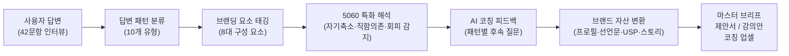
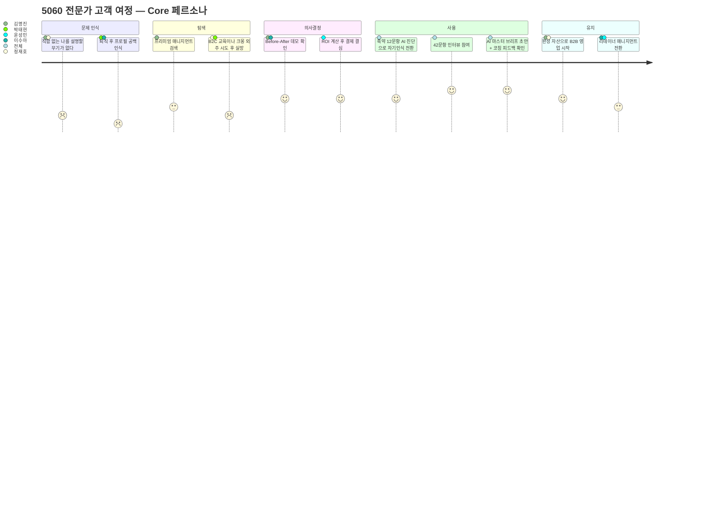

# 5060 프리미엄 브랜드 매니지먼트 PRD v0.3 — Part 1

| 항목 | 내용 |
| :--- | :--- |
| **Owner 팀** | 브랜드 매니지먼트 사업부 (대표 1인 + AI Ops) |
| **최종 업데이트** | 2026-04-25 |
| **문서 버전** | v0.3 — 코칭 가이드 42문항 통합본 |
| **이전 버전** | [v0.2 — 품질 리뷰 반영본](../../PRD-From-VPS-Sample/03_PRD-Drafts/PRD__v1.0.md) |
| **변경 이력** | 42문항 코칭 프레임워크 통합, 답변 패턴 분류 체계 신설, 브랜드 아웃풋 맵 추가, AI 코칭 품질 NFR 신설, F9~F14 신규 기능 6건, 데이터 모델 확장, 실험 E5~E8 추가 |
| **근거 문서** | [PRD v0.2](../../PRD-From-VPS-Sample/03_PRD-Drafts/PRD__v1.0.md) / [나다운 브랜딩 5060 코칭 가이드 42Q](../../자료/나다운브랜딩_5060코칭가이드_42Q.md) |
| **상태** | 🟡 Draft — 이해관계자 리뷰 대기 |

---

## 1. 개요·목표

### 1-1. 문제 정의 (Pain 지표 포함)

5060 고경력 전문가(퇴직·전환기 임원, 연구원, 전문직)는 풍부한 암묵지를 보유하고 있으나, 이를 시장이 구매 가능한 B2B 자산(제안서·강의안)으로 변환하지 못해 **수익 기회를 상실**하고 있다.

| # | Pain | 실패 KPI (현재 기준선) | 수치 근거 |
| :---: | :--- | :--- | :--- |
| P1 | **경력 언어화 실패** — 직함은 있으나 ROI 기반 가치 제안 문장이 없음 | B2B 제안서 완성률 ≤ **5%** (3개월 내 1건도 완성하지 못하는 비율 95%) | JTBD 인터뷰: *"석 달째 빈 화면만 켜놓고 한 줄도 못 썼어요."* |
| P2 | **자산 분산·신뢰 저하** — 프로필·제안서·SNS가 파편화 | B2B 플랫폼 프로필 조회수 **0건/월**, 컨택 전환율 **0%** | JTBD 인터뷰: *"플랫폼에 가입은 했는데 조회수가 0입니다."* |
| P3 | **실행 진입 장벽(체면·디지털 피로)** — PPT 등 디지털 도구 조작 거부 | 서비스 자체 진행 시도율 **< 10%**, 외주 만족도 **2.0/5.0** | JTBD 인터뷰: *"크몽 외주 줘봤자 속 빈 강정."* |
| P4 | **기존 대안의 구조적 한계** — 전직 지원·코칭·매칭 플랫폼 이탈 | 기존 서비스 이용 후 B2B 수주 성공률 **< 3%**, 재구매율 **< 15%** | 경쟁사 20+社 분석 결과 |
| P5 | **직함 의존 정체성** — 직함·직위가 제거되면 자기를 설명할 언어 자체가 없음 | 자기소개 시 직함 의존 비율 **≥ 85%**, 가치 기반 소개 가능 비율 **< 10%** | 코칭 가이드 Q1 패턴 분석: *"직함 없이 자신을 소개한 경험 자체가 드물다"* |
| P6 | **강점·가치·스토리의 비구조화** — 경험은 풍부하나 브랜드 자산으로 구조화되지 않음 | 핵심 가치 3가지 즉시 열거 가능 비율 **< 20%**, 브랜드 원라이너 보유율 **< 5%** | 코칭 가이드 Q20·Q41 패턴: *"경력자일수록 한 문장으로 자신을 표현하는 것을 어려워한다"* |
| P7 | **자기축소 및 실패 노출 회피** — 성취를 과소평가하고 실패 경험 공유를 거부 | 자기축소형 답변 비율 **≥ 60%**, 실패 서사 공유 거부율 **≥ 40%** | 코칭 가이드 Q2·Q15 패턴: *"자랑스럽다는 감정을 쉽게 축소하는 경향"* |

### 1-2. 목표 (Desired Outcome 수치화)

> **Product Vision:** 5060 전문가의 축적된 경험을 **42문항 구조화 인터뷰 기반으로 진단**하고, **답변 패턴을 해석**한 뒤, **브랜드 프로필·B2B 제안서·강의안으로 변환**하는 AI 기반 코칭 시스템이다. 단순히 인터뷰 내용을 제안서로 바꾸는 서비스가 아니라, 정체성·가치·강점·스토리·타깃·메시지·채널·임팩트를 **구조적으로 진단하고 코칭하여 브랜드 자산으로 변환하는 Done-for-you 프리미엄 매니지먼트 시스템**을 구축한다.

### 1-3. 성공 지표 (북극성 KPI / 보조 KPI)

> *기존 v0.2 KPI 표 전체 유지 (변경 없음)*

| 구분 | KPI | 기준선 | 목표값 | 측정 주기 | 측정 경로 |
| :---: | :--- | :--- | :--- | :--- | :--- |
| **⭐ 북극성** | **고객 1인당 B2B 수주 건수** | 0건 | **≥ 2건** | 분기 | Supabase `projects.outcome_count` |
| 보조 1 | 마스터 브리프 초안 생성 소요시간 | 48시간 | **≤ 30분** | 건별 | `briefs.created_at` 타임스탬프 |
| 보조 2 | Option B(880만 원) 전환율 | N/A | **≥ 10%** | 월간 | Supabase 조인 쿼리 |
| 보조 3 | 고객 만족도(NPS) | N/A | **≥ 70** | 프로젝트 종료 시 | Typeform NPS 설문 |
| 보조 4 | 리테이너 전환율 | N/A | **≥ 30%** | 분기 | Supabase `retainers` |
| 보조 5 | AI 진단 리포트 완독 → CTA 클릭율 | N/A | **≥ 10%** | 주간 | GA4 이벤트 |
| 보조 6 | 월간 신규 진단 리드 수 | 0명 | **≥ 50명** | 월간 | Supabase `leads` |

### 1-4. 핵심 작동 구조 *(NEW)*

> **핵심 원리:** 사용자의 답변은 단순 텍스트가 아니라, 8개 브랜딩 구성 요소(정체성·핵심 가치·강점·스토리·이상적 고객·핵심 메시지·채널 전략·레거시)에 매핑되는 **브랜드 원재료**이다. AI는 이 원재료에서 패턴을 읽고, 5060 특화 인사이트를 적용하여 코칭 피드백을 생성하며, 최종적으로 구조화된 브랜드 자산으로 변환한다.

---

## 2. 사용자와 페르소나

### 2-1. 핵심 페르소나 요약

> **AOS-DOS 기회점수 사분면** 기반으로 Q1(High AOS / High DOS) 5인을 최우선 공략 타깃으로 설정한다.

| Tier | 페르소나 | 핵심 Pain | AOS | DOS | 서비스 핏 |
| :---: | :--- | :--- | :---: | :---: | :--- |
| **🔥 Core** | **김명진 (55)** 前 대기업 전략기획 임원 | 직함 대체용 B2B 제안서 변환 방법 부재 | 4.00 | 3.60 | 압도적 폭발력. 최우선 공략 |
| **🔥 Core** | **정재호 (59)** 1금융권 영업본부장 | 아날로그 자산 → 디지털 설계 파트너 부재 | 3.60 | 2.80 | Done-for-you 전통 관리직 |
| **🔥 Core** | **박태현 (58)** 국책연구소 수석연구원 | 딥테크 지식 → B2B 언어 번역 불가 | 2.70 | 1.75 | R&D/전문직 병목 해소 |
| **💎 Core** | **이수아 (52)** 외국계 HR 총괄 임원 | 경험 → 기업교육 패키지 구조화 한계 | 2.40 | 1.60 | HR/코칭/강연 확산성 |
| **💎 Adj** | **윤성민 (48)** B2B SaaS 스타트업 대표 | 오너 PR·강의안 기획 시간 절대 부족 | 2.25 | 1.60 | 법인 예산 활용 가능 |

### 2-2. 페르소나별 코칭 프로필 *(NEW)*

| 페르소나 | 브랜딩 장애 유형 | 예상 답변 패턴 | 필요한 코칭 방식 | 최종 변환 자산 |
| :--- | :--- | :--- | :--- | :--- |
| **김명진** 前 임원 | 직함 의존 정체성, ROI 언어 부족, 성과 중심 서사 | Q1: 직함·역할만 말함 / Q2: 외적 성과만 나열 / Q13: 암묵지 상태("그냥 한다") | 직함 제거 후 의사결정 원칙과 전략 방법론 추출. Q6 의사결정 기준에서 브랜드 철학 도출. Q13에서 암묵지를 명시적 방법론으로 언어화 | C-Level 전략 제안서, 고문 자문 프로필, 전략 방법론 강의안 |
| **정재호** 영업본부장 | 디지털 피로, 구술형 사고, 자기표현 부담 | Q1: 타인 시각으로 말함 / Q4: 직업·전공 영역 중심 / Q28: 디지털 거부감 | 구술 내용을 구조화된 B2B 메시지로 변환. 오프라인 강연을 1순위 채널로 설계. 타이핑 0% 원칙 적용 | 영업 리더십 강의안, 자문 제안서, 오프라인 강연 프로필 |
| **박태현** 수석연구원 | 전문용어 의존, 시장 언어 번역 불가, 타깃 과확장 | Q9: "모든 사람" 타깃 / Q34: 자신 역량 중심 / Q35: 차별점 인식 부족 | 딥테크 지식을 비전문가 언어로 번역. Q33에서 타깃 좁히기. Q35에서 경험 기반 차별화 도출 | 기술 자문 제안서, R&D 리더십 강의안, 기술 브리핑 템플릿 |
| **이수아** HR 총괄 | 경험 나열형, 체계화 미흡, 가치 중심 사고 가능 | Q2: 타인을 도운 순간 / Q11: 태도·성향 중심 / Q26: 구체적 사람 묘사 | HR 경험을 기업교육 커리큘럼으로 구조화. Q13에서 HR 방법론 명시화. 코칭·강연 브랜드로 포지셔닝 | 기업교육 패키지, HR 코칭 프로그램, 리더십 강의안 |
| **윤성민** 대표 | 시간 부족, 자기 객관화 미완, 법인 비용 활용 | Q24: 현재 직업의 연장 / Q21: 너무 길고 복잡 / Q38: 여러 메시지 나열 | 핵심 선택 압축 훈련. Q41에서 7개 단어 이하 원라이너 도출. 법인 결제 구조에 맞춘 패키지 설계 | 오너 PR 프로필, 시그니처 강연 1종, 법인 브랜딩 에셋 |

### 2-3. 고객 여정 Pain·Needs 맵

