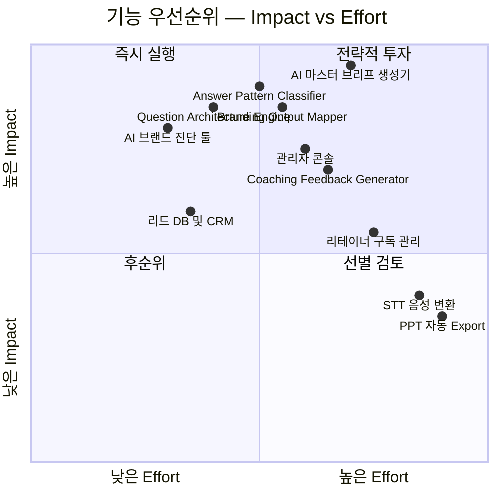

# PRD v0.3 — Part 3: 사용자 스토리 AC 보강 + 기능 요구사항

---

## 7. 사용자 스토리와 수용 기준 (AC) — 코칭 기반 보강

> *기존 Story 1~4의 AC 표는 v0.2 원본을 그대로 유지한다. 아래는 추가되는 코칭 기반 AC만 기술한다.*

### 7-1. 코칭 기반 공통 AC — 답변 충분성

| AC# | Given | When | Then | 측정 임계치 |
| :---: | :--- | :--- | :--- | :--- |
| AC-Suf-1 | 고객이 42문항 중 **20문항 미만** 응답 | 마스터 브리프 생성 요청 | 시스템이 "응답 부족(최소 20문항 필요)" 경고 출력, 생성 차단 | 차단 정확도 **100%** |
| AC-Suf-2 | 고객이 응답한 문항 중 **평균 답변 길이 < 100자** | AI 분석 시작 | 시스템이 "답변 보충 필요" 알림 + 해당 문항 목록 표시 | 부족 문항 식별 정확도 ≥ **95%** |
| AC-Suf-3 | 고객이 특정 질문에 핵심 키워드 0개 추출 가능 상태 | AI가 답변을 분석하면 | 해당 문항에 대한 보완 질문 1~2개를 자동 생성 | 보완 질문 적합도 ≥ **85%** |

### 7-2. 코칭 기반 공통 AC — 답변 패턴 분석

| AC# | Given | When | Then | 측정 임계치 |
| :---: | :--- | :--- | :--- | :--- |
| AC-Pat-1 | 고객이 Q1 자기소개에 직함·회사명 중심으로 답변 | AI가 답변 분석 | "직함 의존 정체성" 패턴으로 분류 + 직함 없이 남는 가치·태도 후속 질문 생성 | 패턴 분류 정확도 ≥ **85%**, 검수자 동의율 ≥ **80%** |
| AC-Pat-2 | 고객이 Q2에서 "별로 없다", "당연한 거" 등 축소 표현 사용 | AI가 답변 분석 | "자기축소형" 패턴으로 분류 + 재프레이밍 코칭 메시지 생성 | 자기축소 감지 정밀도 ≥ **80%** |
| AC-Pat-3 | 고객이 Q9/Q26에서 "모든 사람" 타깃 표현 | AI가 답변 분석 | "타깃 과확장형" 패턴으로 분류 + 좁히기 코칭 질문 생성 | 타깃 과확장 감지 정밀도 ≥ **85%** |
| AC-Pat-4 | 고객이 Q15 실패 질문에 50자 미만 또는 회피 답변 | AI가 답변 분석 | "실패 회피형" 패턴으로 분류 + 대안 탐색 질문 제공 + 검수자에게 "사람 코치 개입 권장" 플래그 | 회피 감지 정밀도 ≥ **80%** |

### 7-3. 코칭 기반 공통 AC — 브랜드 자산 매핑

| AC# | Given | When | Then | 측정 임계치 |
| :---: | :--- | :--- | :--- | :--- |
| AC-Map-1 | 고객이 42문항 중 20문항 이상 응답 | 마스터 브리프 생성 요청 | 각 답변을 8개 브랜드 구성 요소 중 하나 이상에 매핑 + 누락 영역 표시 | 브랜드 요소 매핑률 ≥ **90%** |
| AC-Map-2 | 특정 브랜드 구성 요소에 매핑된 답변이 0건 | 브리프 생성 전 검증 시 | 해당 영역에 대한 보완 질문을 자동 생성 | 보완 질문 생성률 **100%** (누락 영역 발생 시) |

### 7-4. 코칭 기반 공통 AC — 최종 출력 품질

| AC# | Given | When | Then | 측정 임계치 |
| :---: | :--- | :--- | :--- | :--- |
| AC-Out-1 | 20문항 이상 응답 + 매핑 완료 | 마스터 브리프 생성 완료 시 | 브랜드 원라이너, 가치 선언문, USP, 핵심 스토리, 타깃 페르소나, B2B 제안 메시지가 각 1건 이상 생성 | 6개 산출물 생성율 **100%** |
| AC-Out-2 | 브리프 생성 완료 | 고객이 브리프를 검토하면 | "내 핵심을 정확히 짚었다" 동의율 기준 이상 | 동의율 ≥ **85%** |
| AC-Out-3 | 브리프 생성 완료 | 검수자가 AI 코칭 해석 메모를 검토하면 | 일반론·뻔한 조언 비율이 기준 이하 | 일반론 비율 < **10%** |

---

## 8. 기능 요구사항 (Functional) — MoSCoW 우선순위

### 8-1. 우선순위 매트릭스

### 8-2. 기능 목록

#### 기존 기능 (F1~F8) — F1 보강

| 우선순위 | 기능 | 설명 | 대안 대비 가치 근거 |
| :---: | :--- | :--- | :--- |
| **Must** | **F1. AI 마스터 브리프 생성기** (Core Engine) — **보강** | ① 42문항 인터뷰 텍스트 입력 → ② 질문별 브랜딩 요소 태깅 → ③ 답변 패턴 분석(10개 유형) → ④ 5060 특화 코칭 해석 → ⑤ 브랜드 프로필 초안 생성(8개 섹션) → ⑥ B2B 제안서·강의안 구조 변환 → ⑦ 운영자 검수용 코칭 인사이트 표시 | 기존 수작업 대비 **96배 속도 향상 + 코칭 해석 자동화** |
| **Must** | **F2. AI 브랜드 진단 툴** (Lead Funnel) — **고도화** | 축약형 12~16문항 객관식+단답형 진단 → AI 분석 → 브랜드 지수·약점·강점 리포트 즉시 출력 → CTA. "이 답변이 어디에 쓰이는지" 안내 문구 포함 | 5문항 대비 자기인식 깊이 ↑, CTA 전환율 목표 1.5배 |
| **Must** | **F3. 관리자 콘솔** | 인터뷰 Raw 입력 → AI 변환 결과 + 코칭 인사이트 메모 일괄 반환 → 검수 UI | 운영자 1인 월 6건 병렬 처리 |
| **Must** | **F4. 리드 DB (Supabase)** | 진단 응답자 정보 자동 적재 + 팔로업 트래킹 | 데이터 누락 0% |
| **Should** | **F5. 고객 맞춤형 트래킹 대시보드** | 자산화 진척 현황 실시간 조회 | NPS +10p 목표 |
| **Should** | **F6. 리테이너 구독 관리** | 월정액 구독 관리 + 제안서 피보팅 이력 | LTV 1.5배 |
| **Could** | **F7. STT 연동** | 녹음 → 자동 텍스트 변환 | V2 이후 |
| **Won't** | **F8. PPT 자동 Export** | 브리프 → PPT 자동 생성 | V2 이후 |

#### 신규 기능 (F9~F14)

| 우선순위 | 기능 | 설명 | 대안 대비 가치 | 구현 난이도 | MVP 포함 |
| :---: | :--- | :--- | :--- | :---: | :---: |
| **Must** | **F9. Question Architecture Engine** | 42문항을 브랜딩 요소, 질문 의도, 결과물 연결 기준으로 관리하는 질문 메타데이터 엔진. 각 질문의 파트, 브랜딩 요소, 의도, 연결 산출물, MVP 포함 여부를 구조화 | 수동 관리 대비 질문 변경 시 산출물 연결 자동 업데이트 | 중 | ✅ |
| **Must** | **F10. Answer Pattern Classifier** | 사용자 답변을 직함 중심·가치 중심·자기축소형·회피형·타깃 과확장형 등 10개 유형으로 분류. NLP 키워드 매칭 + LLM 문맥 분석 결합 | 수동 검수 대비 패턴 분류 소요시간 **90% 단축** | 중-높 | ✅ |
| **Must** | **F11. Branding Output Mapper** | 각 답변을 브랜드 원라이너·가치 선언문·USP·스토리·타깃·채널 전략 등 최종 산출물에 연결. 누락 영역 자동 식별 + 보완 질문 트리거 | 수동 매핑 대비 누락 영역 **즉시 식별** | 중 | ✅ |
| **Should** | **F12. Coaching Feedback Generator** | 답변 패턴에 따라 5060 특화 코칭 피드백 생성. 168개 코칭 스크립트 기반 프롬프트 + 보완 질문 자동 생성 | 일반 피드백 대비 "정확히 짚었다" 만족도 ≥ 4.3/5.0 | 높 | V1.5 |
| **Should** | **F13. Report Generation Rule Engine** | 누적 답변 기반 브랜드 프로필 8개 섹션 + 진단 리포트 + 마스터 브리프를 규칙 기반으로 구조화 생성 | 자유형 생성 대비 산출물 구조 일관성 **≥ 95%** | 높 | V1.5 |
| **Could** | **F14. Human Coaching Handoff** | AI 분석 중 사람 코치 개입 필요 영역 자동 표시. 실패 회피형·심층 정서 영역·가치 갈등 영역 감지 시 상담 CTA 연결 | 무검수 자동 리포트의 오류 리스크 **제거** | 중 | V2 |
