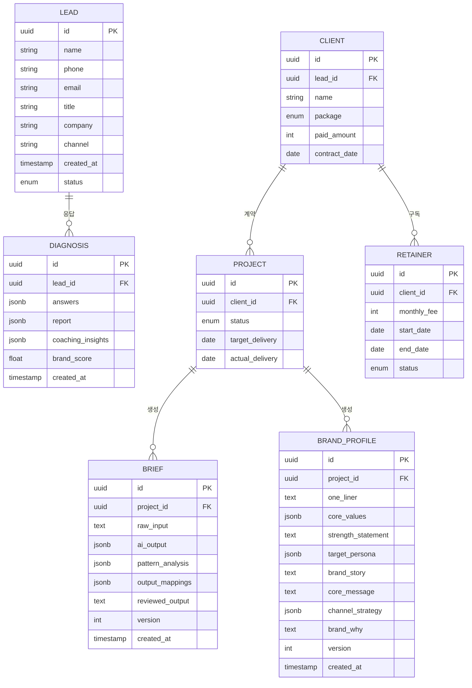

# PRD v0.3 — Part 4: NFR · 데이터 · Handoff · 범위 · 실험

---

## 9. 비기능 요구사항 (NFR)

> *기존 v0.2의 §5-1 성능, §5-2 신뢰성, §5-3 보안, §5-4 비용, §5-5 모니터링은 전체 유지. 아래는 추가/보강 항목만 기술한다.*

### 9-6. AI 코칭 품질 *(NEW)*

| 항목 | 요구 수준 | 측정 방법 |
| :--- | :--- | :--- |
| 답변 패턴 분류 정확도 | 검수자 기준 ≥ **85%** | 검수자가 AI 분류 결과를 승인/거부 태깅 → 월간 집계 |
| 브랜드 요소 매핑 정확도 | 검수자 기준 ≥ **90%** | 매핑된 브랜딩 요소와 검수자 판단 일치율 |
| AI 코칭 톤 적합도 | 5060 고객 평가 ≥ **4.3/5.0** | 브리프 검수 미팅 후 5점 척도 설문 |
| 일반론·뻔한 조언 비율 | 검수자 태깅 기준 < **10%** | 검수자가 "일반론" 태깅한 문장 수 / 전체 코칭 문장 수 |
| 자기축소 재프레이밍 성공률 | 고객 동의율 ≥ **80%** | "AI가 제시한 재해석에 동의하십니까?" 설문 |
| 최종 브랜드 문장 사용 가능성 | 고객 "바로 활용 가능" 응답 ≥ **80%** | 납품 후 설문: "이 문장을 수정 없이 사용할 수 있습니까?" |
| 보완 질문 적합도 | 검수자 기준 ≥ **85%** | 보완 질문이 실제 누락 영역을 정확히 겨냥하는지 검수 |

### 9-3 보안 보강 *(추가)*

| 항목 | 요구 수준 | 비고 |
| :--- | :--- | :--- |
| **자기서사 데이터 보호** | 경력 서사, 실패 경험, 조직 경험, 개인 신념 등은 **민감한 자기서사 데이터**로 취급 | 일반 개인정보(이름·연락처)와 별도 보호 등급 적용 |
| **AI 학습 재사용 금지** | 고객 답변 데이터를 **AI 학습용으로 재사용 금지** 또는 **별도 동의** 필요 | Claude API 이용 약관 내 데이터 보호 조항 확인 |
| **리포트 외부 공유 검수** | 최종 리포트 외부 공유 전 **고객 검수 단계 필수** | 고객 미승인 상태로 리포트 외부 전송 시 시스템 차단 |

---

## 10. 데이터·인터페이스 개요

### 10-1. 핵심 엔터티 ERD (확장)



### 10-2. 신규 엔터티 상세 *(NEW)*

#### MVP 접근: jsonb 내 구조화

MVP에서는 신규 엔터티를 별도 테이블로 분리하지 않고, 기존 `DIAGNOSIS.answers`, `BRIEF.ai_output` jsonb 필드 내에 다음 구조를 포함한다:

```json
{
  "interview_answers": [
    {
      "question_id": "Q01",
      "part_id": "PART1",
      "branding_element": "브랜드 정체성",
      "raw_text": "저는 삼성전자 전략기획 상무로 25년간...",
      "detected_patterns": ["직함 중심형"],
      "pattern_risk_level": "중",
      "ai_coaching_note": "직함 의존 정체성 패턴. 직함 제거 후 의사결정 원칙 추출 필요",
      "follow_up_question": "직함이 사라져도 남는 당신을 찾아봅시다",
      "output_mapping": ["브랜드 원라이너", "프로필 소개문"],
      "human_handoff_flag": false
    }
  ],
  "brand_profile_draft": {
    "one_liner": "...",
    "core_values": ["...", "...", "..."],
    "strength_statement": "...",
    "target_persona": "...",
    "brand_story": "...",
    "core_message": "...",
    "channel_strategy": "...",
    "brand_why": "..."
  },
  "coverage_report": {
    "mapped_elements": 7,
    "total_elements": 8,
    "missing_elements": ["채널 전략"],
    "補완_questions_generated": 2
  }
}
```

#### V2 전환 계획: 정규화 테이블

| 엔터티 | 주요 필드 | V2 전환 트리거 |
| :--- | :--- | :--- |
| QUESTION | question_id, part_id, question_text, branding_element_id, intent, order | 파일럿 3명 완료 후 |
| QUESTION_PART | part_id, title, purpose, question_range | 동시 전환 |
| BRANDING_ELEMENT | element_id, name, description, connected_questions | 동시 전환 |
| ANSWER | answer_id, user_id, question_id, raw_text, summary, created_at | 월 프로젝트 > 6건 시 |
| ANSWER_PATTERN | pattern_id, question_id, pattern_name, signal_interpretation, risk_level | 동시 전환 |
| COACHING_FEEDBACK | feedback_id, pattern_id, coaching_message, follow_up_question | F12 구현 시 |
| OUTPUT_MAPPING | question_id, brand_profile_section, output_type | 동시 전환 |
| BRAND_PROFILE | profile_id, project_id, identity, core_values, strengths, story, ideal_client, core_message, channel_strategy, legacy_impact, version | 동시 전환 |
| REPORT_SECTION | section_id, profile_id, section_type, content, order | F13 구현 시 |

### 10-3. 외부/내부 API 개요

> *기존 v0.2 API 표 전체 유지 (변경 없음)*

---

## 11. Human Coaching Handoff *(NEW — 챕터 E)*

### 11-1. AI 단독 처리 가능 영역

| 영역 | AI 처리 내용 | 신뢰 수준 |
| :--- | :--- | :---: |
| 답변 패턴 분류 | 10개 패턴 중 해당 유형 식별 | 높 |
| 브랜딩 요소 태깅 | 8개 구성 요소에 답변 매핑 | 높 |
| 브랜드 프로필 초안 | 8개 섹션 초안 문장 생성 | 중 |
| 보완 질문 생성 | 누락 영역·부족 답변에 대한 후속 질문 | 중 |
| 산출물 구조 변환 | 브리프 → 제안서/강의안 뼈대 | 중 |

### 11-2. 사람 코치 개입 필요 영역

| 영역 | 개입 이유 | 트리거 조건 |
| :--- | :--- | :--- |
| **실패 회피형 답변 심층 탐색** | AI가 단정하면 역효과. 신뢰 관계 기반 탐색 필요 | Q15 답변 < 50자 + 회피 패턴 감지 |
| **가치 갈등 해소** | Q6·Q20·Q42 답변 간 가치 모순 발생 시 | 가치 키워드 일관성 점수 < 0.5 |
| **심층 정서 영역** | Q31 두려움, Q25 아쉬움 등 심리적 깊이 필요 | 답변에 감정 강도 높은 표현 + 눈물/침묵 표시 |
| **브랜드 방향 대전환** | Q24에서 "완전히 새로운 일" 선택 시 | 기존 경력과 새 방향의 연결점 0개 |
| **자기 효능감 극저** | 다수 질문에서 "없다/모르겠다" 반복 | 회피형 답변 비율 ≥ 50% |

### 11-3. 상담 CTA 연결 기준

| 조건 | CTA 유형 | 연결 방식 |
| :--- | :--- | :--- |
| 진단 완료 후 자기인식 전환 체감 | **프리미엄 매니지먼트 상담** | 진단 리포트 하단 CTA 버튼 |
| AI 브리프에 "사람 코치 권장" 플래그 ≥ 3건 | **코칭 세션 추가** | 관리자 콘솔 알림 → 수동 연락 |
| 브랜드 프로필 완성 후 실행 장벽 높음 | **실행 코칭 패키지** | 납품 후 7일 팔로업 설문에서 트리거 |

### 11-4. 프리미엄 매니지먼트 업셀 기준

| 업셀 경로 | 트리거 | 패키지 |
| :--- | :--- | :--- |
| 진단 → Option A | 진단 리포트 CTA 클릭 + 상담 완료 | 650만 원 (브리프 + 에셋 6종) |
| 진단 → Option B | 진단 리포트 CTA 클릭 + 상담 완료 + ROI 시뮬레이션 동의 | 880만 원 (브리프 + 에셋 12종 + 제안서 + 강의안) |
| Option B → 리테이너 | Option B 납품 완료 + NPS ≥ 8 | 월 50~100만 원 |

---

## 12. 범위 (In/Out), 리스크·가정·의존성

### 12-1. 범위 정의 (확장)

| 구분 | 항목 |
| :--- | :--- |
| **✅ In (MVP V1)** | AI 브랜드 진단 툴 (축약 12~16문항, 웹 기반) — F2 고도화 |
| | AI 마스터 브리프 생성기 (관리자 콘솔) — F1 보강 |
| | 리드 DB 자동 적재 (Supabase) — F4 |
| | 랜딩페이지 (Next.js) |
| | 진단 결과 리포트 웹뷰 출력 |
| | **질문별 브랜딩 요소 태깅 (F9 MVP)** *(NEW)* |
| | **답변 패턴 분류 최소 버전 (F10 MVP)** *(NEW)* |
| | **브랜드 원라이너 / 핵심 가치 / 강점 / 타깃 / 프로필 소개문 생성 (F11 MVP)** *(NEW)* |
| | **운영자 검수용 AI 해석 메모 (F1 보강)** *(NEW)* |
| | **핵심 12~16문항 기반 축약 진단** *(NEW)* |
| **❌ Out (V1 제외)** | 결제 시스템 (수동 계좌이체로 대체) |
| | SNS 회원가입/OAuth 로그인 |
| | PPT 자동 Export — F8 |
| | STT 음성 자동 변환 — F7 |
| | **완전 자동 코칭 (사람 검수 없는 자동 납품)** *(NEW)* |
| | **무검수 자동 리포트 납품** *(NEW)* |
| | **사용자의 모든 답변을 정답처럼 단정하는 기능** *(NEW)* |
| | **심리상담 또는 치료적 해석** *(NEW)* |
| | **자동 PPT 디자인 생성** *(NEW)* |
| | 모바일 네이티브 앱 |
| **🔜 Next (V2)** | STT 연동 → 구술 자동 입력 |
| | PPT/PDF 자동 생성 Export |
| | 고객 셀프서비스 대시보드 — F5 |
| | 리테이너 구독 자동 결제 — F6 |
| | **완전 자동 코칭 피드백 생성 — F12** *(NEW)* |
| | **리포트 자동 구조화 생성 — F13** *(NEW)* |
| | **Human Coaching Handoff 자동화 — F14** *(NEW)* |
| | 알럼나이 커뮤니티 기능 |

### 12-2. 리스크 매트릭스 (확장)

> *기존 R1~R6 유지. 아래는 추가 리스크.*

| # | 리스크 | 발생 확률 | 영향도 | 대응 전략 | 트리거 임계치 |
| :---: | :--- | :---: | :---: | :--- | :--- |
| R7 | **AI가 사용자 서사를 과도하게 단정** — 가설이 아닌 확정적 표현으로 고객 반발 | 중 | **상** | AI 코칭 출력에 "~일 수 있습니다" 가설 표현 강제. 운영자 검수 필수. | 고객 "과도한 단정" 불만 **≥ 2건/월** → 프롬프트 톤 긴급 수정 |
| R8 | **질문이 길어 이탈 발생** — 42문항 전체 진행 시 완주율 급감 | 높 | **중** | MVP는 축약 12~16문항. 전체 42문항은 프리미엄 대면/화상 인터뷰에서만 사용 | 축약 진단 완주율 **< 50%** → 문항 수 12 → 8개로 축소 A/B |
| R9 | **5060 고객이 자기표현을 부담스러워함** | 중 | **중** | 예시 답변 제공, 구술 입력 옵션, 코칭형 안내 문구("정답은 없습니다") 적용 | 문항별 "건너뛰기" 비율 **> 30%** → 안내 문구 A/B 테스트 |
| R10 | **브랜드 결과물이 추상적** — "좋은 말이지만 어디에 쓰는지 모르겠다" | 중 | **상** | 최종 산출물 사용처 명확 지정: 프로필, 제안서, 강의안, SNS, 상담 CTA | "바로 활용 가능" 응답 **< 60%** → 산출물 사용처 매핑 재설계 |
| R11 | **AI 코칭이 일반론화** — 패턴별 특화 없이 범용 조언 반복 | 중-높 | **상** | 질문별 패턴 코칭 스크립트 168개를 프롬프트에 삽입. 검수자가 "일반론" 태깅 | 일반론 비율 **> 15%** → 프롬프트 코칭 스크립트 리팩토링 |

### 12-3. 가정 및 의존성

> *기존 v0.2 가정·의존성 전체 유지. 아래는 추가.*

| 구분 | 항목 |
| :--- | :--- |
| **가정 (추가)** | 42문항 코칭 가이드의 168개 패턴 코칭 스크립트가 Claude API System Prompt에 효과적으로 삽입 가능함 |
| | 축약 12~16문항만으로도 상담 전환에 충분한 자기인식 효과를 줄 수 있음 |
| | 답변 패턴 분류가 NLP 키워드 매칭 + LLM 문맥 분석 결합으로 ≥ 85% 정확도 달성 가능함 |
| **의존성 (추가)** | **나다운 브랜딩 5060 코칭 가이드 42문항** — 제품의 핵심 IP. 질문 구조·패턴 코칭·브랜드 프로필 연결의 원천 문서 |

---

## 13. 실험·롤아웃·측정

### 13-1. 롤아웃 계획

> *기존 v0.2 Gantt 차트 유지 (변경 없음)*

### 13-2. 실험 설계 및 성공 기준

> *기존 E1~E4 유지. 아래는 추가 실험.*

| # | 실험 가설 | 실험 설계 | 측정 도구 | 성공 기준 | Kill-criteria |
| :---: | :--- | :--- | :--- | :--- | :--- |
| E5 | **42문항 기반 답변 분석은 고객의 핵심 브랜드 언어를 정확히 추출할 수 있다** | 파일럿 3명 대상. AI 분석 결과(브랜드 원라이너·핵심 가치·USP)와 사람 코치 분석 결과를 블라인드 비교 | 외부 코치 3인 블라인드 평가 (5점 척도) | AI-코치 일치율 ≥ **80%** | **Kill:** < 50% → 코칭 스크립트 프롬프트 전면 재설계. **Retry:** 50~79% → 패턴 분류 로직 2주 튜닝 |
| E6 | **축약형 12~16문항 진단만으로도 상담 전환에 충분한 자기인식 효과를 줄 수 있다** | 5문항 vs 12문항 진단 A/B 테스트 (n=100, 그룹당 50명) | GA4 이벤트: 진단 완료율, CTA 클릭율, 상담 신청율 | 12문항 그룹 CTA 클릭율 **≥ 1.5배** | **Kill:** 12문항 완주율 < 40% → 8문항으로 축소. **Retry:** CTA 1.0~1.4배 → 리포트 디자인 A/B |
| E7 | **질문별 "이 답변이 어디에 쓰이는지"를 보여주면 완주율이 올라간다** | 안내 문구 있음/없음 A/B 테스트 (n=100) | GA4 이벤트: 문항별 이탈율, 최종 완주율 | 안내 문구 그룹 완주율 **+15%p** | **Kill:** 차이 < 5%p → 안내 문구 폐기. **Retry:** 5~14%p → 문구 디자인 개선 |
| E8 | **답변 패턴별 코칭 피드백은 고객의 "정확히 짚었다"는 감각을 높인다** | 일반 피드백 vs 패턴 기반 피드백 비교 (파일럿 6명, 3:3 배정) | 5점 척도 만족도 설문 | 패턴 기반 피드백 만족도 ≥ **4.3/5.0** | **Kill:** < 3.0 → 코칭 스크립트 재작성. **Retry:** 3.0~4.2 → 스크립트 정교화 |

---

## 14. 근거 (Proof)

> *기존 v0.2 §9 전체 유지. 아래 1건 추가.*

| # | 핵심 주장 | 근거 유형 | 측정 도구 | 성공 기준 | 실패 시 대체안 | 원천 문서 |
| :---: | :--- | :--- | :--- | :--- | :--- | :--- |
| 8 | 42문항 코칭 가이드의 패턴 분류·코칭 스크립트가 AI 프롬프트에 효과적으로 이식 가능 | 프롬프트 프로토타입 | E5: AI-코치 블라인드 비교 | 일치율 ≥ 80% | 일치율 < 50% → 프롬프트 아키텍처 전면 재설계, 코칭 스크립트 축소 적용 | `나다운브랜딩_5060코칭가이드_42Q.md` |

---

## 15. 다음 단계 (Next Steps)

1. 이해관계자 리뷰 후 피드백 반영 → v0.3 확정
2. 프롬프트 엔지니어링 Sprint 착수: 168개 패턴 코칭 스크립트 System Prompt 이식
3. 축약 12~16문항 진단 폼 설계 및 개발
4. 파일럿 고객 2~3명 섭외 및 계약
5. E5~E8 실험 설계 상세화 및 측정 인프라 구축
6. 디자인 에이전시 시범 계약 체결
7. 답변 패턴 분류기(F10) 프로토타입 개발
