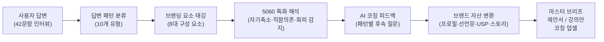
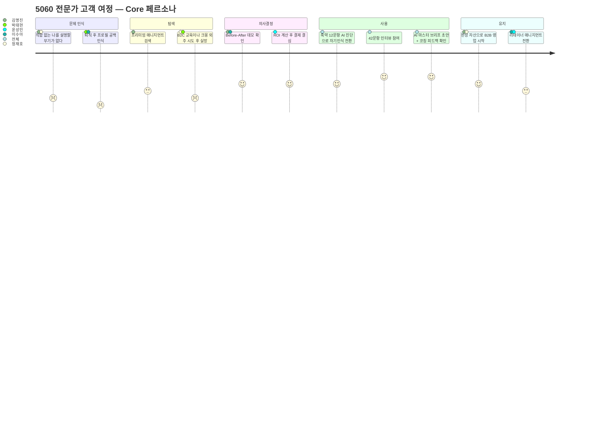
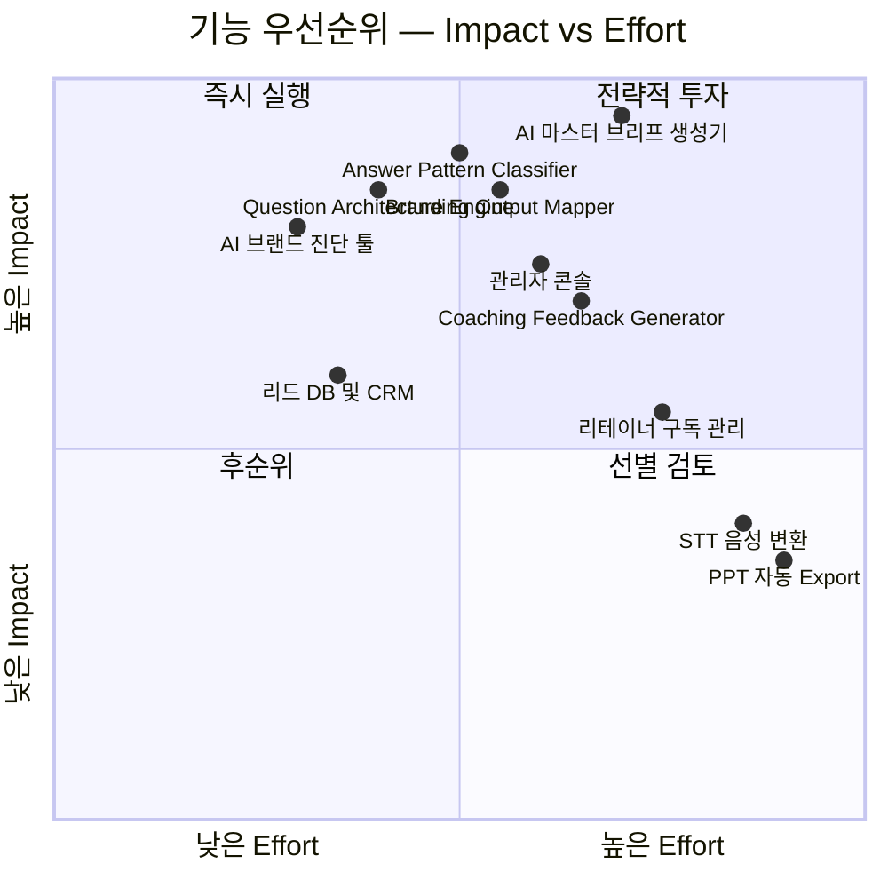
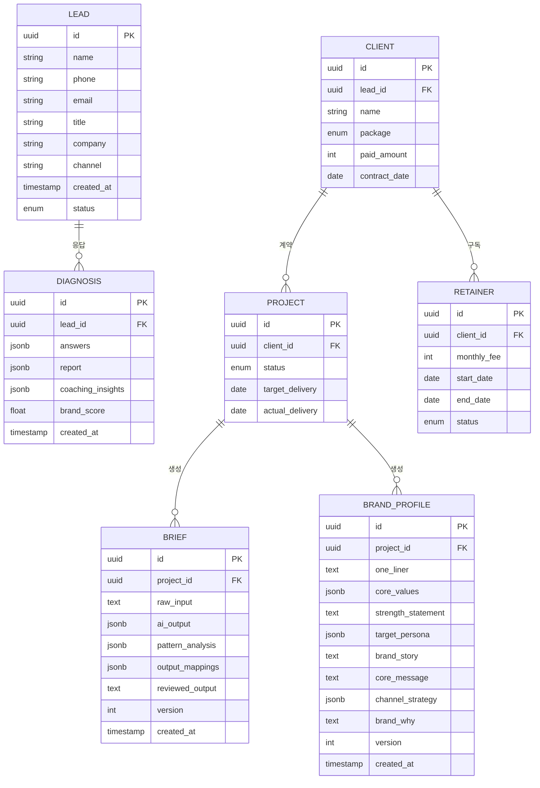

# 5060 프리미엄 브랜드 매니지먼트 PRD v0.3

| 항목 | 내용 |
| :--- | :--- |
| **Owner 팀** | 브랜드 매니지먼트 사업부 (대표 1인 + AI Ops) |
| **최종 업데이트** | 2026-04-25 |
| **문서 버전** | v0.3 — 코칭 가이드 42문항 통합본 |
| **이전 버전** | [v0.2 — 품질 리뷰 반영본](../../PRD-From-VPS-Sample/03_PRD-Drafts/PRD__v1.0.md) |
| **변경 이력** | 42문항 코칭 프레임워크 통합, 답변 패턴 분류 체계 신설, 브랜드 아웃풋 맵 추가, AI 코칭 품질 NFR 신설, F9~F14 신규 기능 6건, 데이터 모델 확장, 실험 E5~E8 추가 |
| **근거 문서** | [PRD v0.2](../../PRD-From-VPS-Sample/03_PRD-Drafts/PRD__v1.0.md) / [나다운 브랜딩 5060 코칭 가이드 42Q](../../자료/나다운브랜딩_5060코칭가이드_42Q.md) |
| **상태** | 🟡 Draft — 이해관계자 리뷰 대기 |

---

## 1. 개요·목표

### 1-1. 문제 정의 (Pain 지표 포함)

5060 고경력 전문가(퇴직·전환기 임원, 연구원, 전문직)는 풍부한 암묵지를 보유하고 있으나, 이를 시장이 구매 가능한 B2B 자산(제안서·강의안)으로 변환하지 못해 **수익 기회를 상실**하고 있다.

| # | Pain | 실패 KPI (현재 기준선) | 수치 근거 |
| :---: | :--- | :--- | :--- |
| P1 | **경력 언어화 실패** — 직함은 있으나 ROI 기반 가치 제안 문장이 없음 | B2B 제안서 완성률 ≤ **5%** (3개월 내 1건도 완성하지 못하는 비율 95%) | JTBD 인터뷰: *"석 달째 빈 화면만 켜놓고 한 줄도 못 썼어요."* |
| P2 | **자산 분산·신뢰 저하** — 프로필·제안서·SNS가 파편화 | B2B 플랫폼 프로필 조회수 **0건/월**, 컨택 전환율 **0%** | JTBD 인터뷰: *"플랫폼에 가입은 했는데 조회수가 0입니다."* |
| P3 | **실행 진입 장벽(체면·디지털 피로)** — PPT 등 디지털 도구 조작 거부 | 서비스 자체 진행 시도율 **< 10%**, 외주 만족도 **2.0/5.0** | JTBD 인터뷰: *"크몽 외주 줘봤자 속 빈 강정."* |
| P4 | **기존 대안의 구조적 한계** — 전직 지원·코칭·매칭 플랫폼 이탈 | 기존 서비스 이용 후 B2B 수주 성공률 **< 3%**, 재구매율 **< 15%** | 경쟁사 20+社 분석 결과 |
| P5 | **직함 의존 정체성** — 직함·직위가 제거되면 자기를 설명할 언어 자체가 없음 | 자기소개 시 직함 의존 비율 **≥ 85%**, 가치 기반 소개 가능 비율 **< 10%** | 코칭 가이드 Q1 패턴 분석: *"직함 없이 자신을 소개한 경험 자체가 드물다"* |
| P6 | **강점·가치·스토리의 비구조화** — 경험은 풍부하나 브랜드 자산으로 구조화되지 않음 | 핵심 가치 3가지 즉시 열거 가능 비율 **< 20%**, 브랜드 원라이너 보유율 **< 5%** | 코칭 가이드 Q20·Q41 패턴: *"경력자일수록 한 문장으로 자신을 표현하는 것을 어려워한다"* |
| P7 | **자기축소 및 실패 노출 회피** — 성취를 과소평가하고 실패 경험 공유를 거부 | 자기축소형 답변 비율 **≥ 60%**, 실패 서사 공유 거부율 **≥ 40%** | 코칭 가이드 Q2·Q15 패턴: *"자랑스럽다는 감정을 쉽게 축소하는 경향"* |

### 1-2. 목표 (Desired Outcome 수치화)

> **Product Vision:** 5060 전문가의 축적된 경험을 **42문항 구조화 인터뷰 기반으로 진단**하고, **답변 패턴을 해석**한 뒤, **브랜드 프로필·B2B 제안서·강의안으로 변환**하는 AI 기반 코칭 시스템이다. 단순히 인터뷰 내용을 제안서로 바꾸는 서비스가 아니라, 정체성·가치·강점·스토리·타깃·메시지·채널·임팩트를 **구조적으로 진단하고 코칭하여 브랜드 자산으로 변환하는 Done-for-you 프리미엄 매니지먼트 시스템**을 구축한다.

### 1-3. 성공 지표 (북극성 KPI / 보조 KPI)

> *기존 v0.2 KPI 표 전체 유지 (변경 없음)*

| 구분 | KPI | 기준선 | 목표값 | 측정 주기 | 측정 경로 |
| :---: | :--- | :--- | :--- | :--- | :--- |
| **⭐ 북극성** | **고객 1인당 B2B 수주 건수** | 0건 | **≥ 2건** | 분기 | Supabase `projects.outcome_count` |
| 보조 1 | 마스터 브리프 초안 생성 소요시간 | 48시간 | **≤ 30분** | 건별 | `briefs.created_at` 타임스탬프 |
| 보조 2 | Option B(880만 원) 전환율 | N/A | **≥ 10%** | 월간 | Supabase 조인 쿼리 |
| 보조 3 | 고객 만족도(NPS) | N/A | **≥ 70** | 프로젝트 종료 시 | Typeform NPS 설문 |
| 보조 4 | 리테이너 전환율 | N/A | **≥ 30%** | 분기 | Supabase `retainers` |
| 보조 5 | AI 진단 리포트 완독 → CTA 클릭율 | N/A | **≥ 10%** | 주간 | GA4 이벤트 |
| 보조 6 | 월간 신규 진단 리드 수 | 0명 | **≥ 50명** | 월간 | Supabase `leads` |

### 1-4. 핵심 작동 구조 *(NEW)*



> **핵심 원리:** 사용자의 답변은 단순 텍스트가 아니라, 8개 브랜딩 구성 요소(정체성·핵심 가치·강점·스토리·이상적 고객·핵심 메시지·채널 전략·레거시)에 매핑되는 **브랜드 원재료**이다. AI는 이 원재료에서 패턴을 읽고, 5060 특화 인사이트를 적용하여 코칭 피드백을 생성하며, 최종적으로 구조화된 브랜드 자산으로 변환한다.

---

## 2. 사용자와 페르소나

### 2-1. 핵심 페르소나 요약

> **AOS-DOS 기회점수 사분면** 기반으로 Q1(High AOS / High DOS) 5인을 최우선 공략 타깃으로 설정한다.

| Tier | 페르소나 | 핵심 Pain | AOS | DOS | 서비스 핏 |
| :---: | :--- | :--- | :---: | :---: | :--- |
| **🔥 Core** | **김명진 (55)** 前 대기업 전략기획 임원 | 직함 대체용 B2B 제안서 변환 방법 부재 | 4.00 | 3.60 | 압도적 폭발력. 최우선 공략 |
| **🔥 Core** | **정재호 (59)** 1금융권 영업본부장 | 아날로그 자산 → 디지털 설계 파트너 부재 | 3.60 | 2.80 | Done-for-you 전통 관리직 |
| **🔥 Core** | **박태현 (58)** 국책연구소 수석연구원 | 딥테크 지식 → B2B 언어 번역 불가 | 2.70 | 1.75 | R&D/전문직 병목 해소 |
| **💎 Core** | **이수아 (52)** 외국계 HR 총괄 임원 | 경험 → 기업교육 패키지 구조화 한계 | 2.40 | 1.60 | HR/코칭/강연 확산성 |
| **💎 Adj** | **윤성민 (48)** B2B SaaS 스타트업 대표 | 오너 PR·강의안 기획 시간 절대 부족 | 2.25 | 1.60 | 법인 예산 활용 가능 |

### 2-2. 페르소나별 코칭 프로필 *(NEW)*

| 페르소나 | 브랜딩 장애 유형 | 예상 답변 패턴 | 필요한 코칭 방식 | 최종 변환 자산 |
| :--- | :--- | :--- | :--- | :--- |
| **김명진** 前 임원 | 직함 의존 정체성, ROI 언어 부족, 성과 중심 서사 | Q1: 직함·역할만 말함 / Q2: 외적 성과만 나열 / Q13: 암묵지 상태("그냥 한다") | 직함 제거 후 의사결정 원칙과 전략 방법론 추출. Q6 의사결정 기준에서 브랜드 철학 도출. Q13에서 암묵지를 명시적 방법론으로 언어화 | C-Level 전략 제안서, 고문 자문 프로필, 전략 방법론 강의안 |
| **정재호** 영업본부장 | 디지털 피로, 구술형 사고, 자기표현 부담 | Q1: 타인 시각으로 말함 / Q4: 직업·전공 영역 중심 / Q28: 디지털 거부감 | 구술 내용을 구조화된 B2B 메시지로 변환. 오프라인 강연을 1순위 채널로 설계. 타이핑 0% 원칙 적용 | 영업 리더십 강의안, 자문 제안서, 오프라인 강연 프로필 |
| **박태현** 수석연구원 | 전문용어 의존, 시장 언어 번역 불가, 타깃 과확장 | Q9: "모든 사람" 타깃 / Q34: 자신 역량 중심 / Q35: 차별점 인식 부족 | 딥테크 지식을 비전문가 언어로 번역. Q33에서 타깃 좁히기. Q35에서 경험 기반 차별화 도출 | 기술 자문 제안서, R&D 리더십 강의안, 기술 브리핑 템플릿 |
| **이수아** HR 총괄 | 경험 나열형, 체계화 미흡, 가치 중심 사고 가능 | Q2: 타인을 도운 순간 / Q11: 태도·성향 중심 / Q26: 구체적 사람 묘사 | HR 경험을 기업교육 커리큘럼으로 구조화. Q13에서 HR 방법론 명시화. 코칭·강연 브랜드로 포지셔닝 | 기업교육 패키지, HR 코칭 프로그램, 리더십 강의안 |
| **윤성민** 대표 | 시간 부족, 자기 객관화 미완, 법인 비용 활용 | Q24: 현재 직업의 연장 / Q21: 너무 길고 복잡 / Q38: 여러 메시지 나열 | 핵심 선택 압축 훈련. Q41에서 7개 단어 이하 원라이너 도출. 법인 결제 구조에 맞춘 패키지 설계 | 오너 PR 프로필, 시그니처 강연 1종, 법인 브랜딩 에셋 |

### 2-3. 고객 여정 Pain·Needs 맵




## 3. Coaching Framework *(NEW — 챕터 A)*

### 3-1. 제품의 핵심 코칭 철학

이 제품은 5060 고경력 전문가를 대상으로 한다. 10~20년 이상 자기 분야를 해온 사람에게 어설픈 공감이나 일반적 조언은 **역효과**를 낳는다. 경력자는 수십 년의 경험으로 형성된 자기 기준이 있다.

| 원칙 | 설명 | 금지 사항 |
| :--- | :--- | :--- |
| **경력 존중** | 사용자의 경험 자체를 브랜드 원재료로 존중한다 | ❌ "이렇게 해보세요" 식 일반 조언 |
| **패턴 기반 해석** | 답변의 내용이 아니라 답변의 **방식**에서 브랜딩 단서를 읽는다 | ❌ 답변을 액면 그대로 수용 |
| **자산 변환 지향** | 모든 코칭은 최종 브랜드 산출물로의 변환을 목표로 한다 | ❌ 탐색만 하고 변환하지 않음 |
| **가설 표현** | AI 해석은 항상 "~일 수 있습니다"로 표현한다 | ❌ "당신은 ~입니다"라는 단정 |
| **비구조화 자산 구조화** | 암묵지를 명시적 방법론·선언문·메시지로 언어화한다 | ❌ 추상적 감상에 머무름 |

### 3-2. 5060 사용자에 대한 전제

| 전제 | 코칭 가이드 근거 | 제품 요건 반영 |
| :--- | :--- | :--- |
| 직함 없이 자기를 소개한 경험이 드물다 | Q1 인사이트 | AI 코칭 시 "직함 의존 패턴" 감지 → 자동 후속 질문 |
| 성취를 "당연한 것"으로 축소한다 | Q2·Q7 인사이트 | "자기축소형 답변" 감지 → 재프레이밍 코칭 |
| 실패 노출에 심리적 저항이 크다 | Q15 인사이트 | "실패 회피형 답변" 감지 → 점진적 탐색 유도 |
| "모든 사람"을 돕겠다며 타깃을 좁히지 못한다 | Q9·Q26 인사이트 | "타깃 과확장형 답변" 감지 → 좁히기 코칭 |
| 디지털 도구에 피로와 거부감이 있다 | Q28·Q40 인사이트 | 타이핑 최소화, 구술 입력, 객관식 비율 증가 |

### 3-3. 답변을 브랜드 자산으로 변환하는 원칙

1. **각 질문은 단독이 아니다.** 파트 전체의 흐름 속에서 누적되어 최종 브랜드 프로필을 완성한다.
2. **답변의 "어디에 쓰이는지"를 항상 보여준다.** 이 답변이 브랜드 프로필의 어떤 섹션에 들어가는지를 명시하면 사용자의 완주 동기가 높아진다.
3. **패턴별 코칭 발언은 실제 사용 가능한 스크립트다.** 코칭 가이드의 168개 패턴 코칭 문장을 AI 프롬프트에 직접 삽입한다.
4. **교차 검증으로 일관성을 확보한다.** Q1(정체성)과 Q21(강점 명제문)과 Q41(원라이너)의 답변 일관성을 교차 분석한다.

---

## 4. Question Architecture *(NEW — 챕터 B)*

### 4-1. 42문항의 구조

| 파트 | 제목 | 질문 범위 | 탐색 목적 | 핵심 브랜딩 요소 |
| :---: | :--- | :---: | :--- | :--- |
| **PART 1** | 나는 어떤 삶을 살아왔는가 | Q01~Q10 | 과거 자원 탐색 | 브랜드 정체성, 핵심 가치, 레질리언스, 전문성, 의사결정 원칙, 브랜드 서사, 지혜 포지셔닝 |
| **PART 2** | 나는 지금 무엇을 가지고 있는가 | Q11~Q22 | 강점·자산 발견 | 강점 포트폴리오, 자연 권위 영역, 방법론 차별화, 네트워크 자산, 열정 영역, 가치 명문화, 인식 갭 |
| **PART 3** | 나는 무엇을 원하는가 | Q23~Q32 | 미래 방향 설정 | 비전, 제2챕터 설계, 이상적 고객, 임팩트, 채널 적합성, 실행 장벽, 브랜드 목적 |
| **PART 4** | 나는 세상에 어떻게 말할 것인가 | Q33~Q42 | 브랜드 언어 구성 | 타깃 페르소나, USP, 브랜드 어휘, 스토리 전환점, 핵심 메시지, 톤앤매너, 채널 전략, 원라이너, WHY |

### 4-2. 질문별 브랜딩 요소 매핑

| 브랜드 구성 요소 | 연결 질문 | 최종 아웃풋 |
| :--- | :--- | :--- |
| **브랜드 정체성** | Q1 · Q7 · Q10 · Q21 · Q41 | 브랜드 원라이너, 프로필 소개문 |
| **핵심 가치 체계** | Q2 · Q6 · Q20 · Q32 · Q42 | 가치 선언문, 브랜드 WHY |
| **강점 & 전문성** | Q4 · Q11 · Q12 · Q13 · Q35 | USP, 방법론, 전문성 포지셔닝 |
| **브랜드 스토리** | Q3 · Q8 · Q15 · Q37 | 핵심 에피소드, 강연 오프닝 |
| **이상적 고객** | Q9 · Q26 · Q33 · Q34 | 타깃 페르소나, 메시지 타깃 |
| **핵심 메시지** | Q10 · Q38 · Q41 · Q42 | 브랜드 포지셔닝 스테이트먼트 |
| **채널 전략** | Q17 · Q19 · Q28 · Q40 | 실행 채널, 콘텐츠 형태 |
| **레거시 & 임팩트** | Q27 · Q31 · Q32 | 브랜드 약속, 사회적 임팩트 |

### 4-3. MVP 축약 문항 기준 (12~16문항)

MVP AI 진단에서는 42문항 전체가 아닌 핵심 문항만으로 축약 진단을 실시한다.

| 축약 기준 | 선정 질문 | 이유 |
| :--- | :--- | :--- |
| **정체성 진단** | Q1, Q7 | 직함 의존 vs 가치 기반 정체성 즉시 파악 |
| **핵심 가치** | Q2, Q6 | 자랑스러운 순간 + 의사결정 기준 = 가치관 교차 추출 |
| **강점 추출** | Q4, Q11, Q13 | 전문성 깊이 + 강점 포트폴리오 + 방법론 차별화 |
| **스토리** | Q8, Q15 | 핵심 서사 + 실패 통합 여부 |
| **타깃 & 메시지** | Q9, Q26, Q33 | 에너지 관계 → 이상적 고객 → 타깃 페르소나 |
| **채널 & 비전** | Q28, Q40 | 채널 적합성 + 채널 전략 |
| **통합 & WHY** | Q41, Q42 | 브랜드 원라이너 + 궁극적 목적 |

**총 16문항:** Q1, Q2, Q4, Q6, Q7, Q8, Q9, Q11, Q13, Q15, Q26, Q28, Q33, Q40, Q41, Q42

### 4-4. 질문 순서 설계 원칙

1. **과거 → 현재 → 미래 → 언어화** 순서를 유지한다 (PART 1→2→3→4)
2. 안전한 질문(Q1 자기소개)에서 시작하여 민감한 질문(Q15 실패, Q31 두려움)으로 점진적 심화
3. 각 파트의 마지막 질문은 해당 파트의 통합 질문(Q10, Q21, Q32, Q42)으로 구성
4. MVP 축약 진단에서도 이 순서를 유지하되, 각 파트에서 핵심 문항만 선별

---

## 5. Answer Pattern Taxonomy *(NEW — 챕터 C)*

### 5-1. 답변 패턴 분류 체계

| # | 패턴명 | 신호 | 리스크 | AI 코칭 방향 | 후속 질문 예시 | 연결 산출물 |
| :---: | :--- | :--- | :--- | :--- | :--- | :--- |
| P1 | **직함 중심형** | "前 OO팀장", "OO대표" 등 직함·직위로만 자기 정의 | 직함 제거 시 정체성 공백 | 직함 없이 남는 가치·태도·방식 탐색 | *"직함이 사라져도 남는 당신을 찾아봅시다"* | 브랜드 원라이너, 프로필 소개문 |
| P2 | **가치 중심형** | 가치관·태도·신념으로 자기 표현 | 추상적 표현에 머물 위험 | 가치를 구체적 행동·사례와 연결 | *"그 가치가 가장 강하게 발휘된 순간은?"* | 가치 선언문, 브랜드 WHY |
| P3 | **자기축소형** | "별로 없다", "당연한 거 아닌가요", 성취 과소평가 | 브랜드 자산 인식 실패 | 축소된 성취를 재프레이밍하여 가치 재인식 | *"거창하지 않아도 됩니다. 아주 작은 것부터 찾아봐요"* | 강점 명제문, USP |
| P4 | **회피형** | "잘 모르겠다", 실패 인정 회피, 답변 최소화 | 핵심 자산 미발굴 | 안전한 대안 질문으로 점진적 탐색 | *"완전한 실패가 아니어도 됩니다. 좀 더 일찍 알았더라면 좋았을 것이 있다면?"* | 브랜드 스토리 (레질리언스) |
| P5 | **모든 사람 타깃형** | "모든 사람에게 도움", 타깃 미설정 | 메시지 희석, 포지셔닝 실패 | 경험이 가장 빛나는 특정 상황·사람으로 좁히기 | *"당신의 20년 경험이 가장 빛나는 사람이 누구인지 집어봅시다"* | 타깃 페르소나, 메시지 타깃 |
| P6 | **경험 나열형** | 시간순 또는 항목별 경험 나열, 구조화 없음 | 핵심 메시지 미도출 | 공통 패턴 추출 → 하나의 통합 메시지로 압축 | *"나열하신 것들의 공통분모가 뭔가요?"* | 핵심 메시지, 포지셔닝 |
| P7 | **방법론 보유형** | 구체적 방법·프로세스를 설명, 체계적 사고 | 이름 붙이기·구조화 미완 | 방법론에 이름 부여 → 교육·컨설팅 브랜드 연결 | *"그 방법에 이름을 붙인다면 뭐라고 부르겠어요?"* | USP, 방법론, 강의안 목차 |
| P8 | **채널 과욕형** | "유튜브도, 블로그도, 강연도 다 하겠다" | 번아웃, 실행력 분산 | 하나의 1순위 채널 선택 → 나머지는 보조 | *"지금 당장 하나만 깊이 한다면 무엇인가요?"* | 채널 전략, 콘텐츠 형태 |
| P9 | **실패 통합형** | 실패를 성장 자원으로 재해석 완료 | (리스크 낮음) | 실패 서사를 브랜드 신뢰 자산으로 즉시 활용 | *"그 성장을 다른 사람들이 10년 단축할 수 있도록 도와줄 수 있다면?"* | 브랜드 스토리, 강연 오프닝 |
| P10 | **실패 회피형** | 실패 언급 거부, 외부 귀인, 자기 보호 상태 | 브랜드 진정성 부족 | 신뢰 환경 조성 후 점진적 탐색 유도 | *"그 상황에서 당신이 선택할 수 있었던 것은 무엇이었나요?"* | (사람 코치 핸드오프 트리거) |

### 5-2. 패턴 감지 규칙 (AI Classifier 기준)

| 감지 대상 | 감지 신호 (NLP 기준) | 리스크 레벨 | 자동 조치 |
| :--- | :--- | :---: | :--- |
| 직함 의존 | 답변 내 "팀장/부장/대표/이사/원장" 등 직위 명사 2회 이상 + 가치·태도 형용사 0개 | 중 | 후속 질문 자동 생성 |
| 자기축소 | "별로", "당연한", "대단한 건 아니", "그냥" 등 축소 표현 3회 이상 | 중 | 재프레이밍 코칭 메시지 삽입 |
| 타깃 과확장 | "모든", "누구나", "다양한 사람" 등 범용 표현 + 구체적 페르소나 정보 0개 | 높 | 좁히기 코칭 + 보완 질문 |
| 실패 회피 | Q15 답변 길이 < 50자 또는 "없다"/"모르겠다" 포함 | 높 | 대안 질문 제공 + 검수자 플래그 |
| 답변 부족 | 전체 답변 문항 < 20개 또는 평균 답변 길이 < 100자 | 높 | 마스터 브리프 생성 차단 |

---

## 6. Branding Output Map *(NEW — 챕터 D)*

### 6-1. 브랜딩 요소 → 최종 산출물 매핑

| 브랜딩 요소 | 원천 질문 | 중간 산출물 | 최종 산출물 | 사용처 |
| :--- | :--- | :--- | :--- | :--- |
| **브랜드 정체성** | Q1·Q7·Q10·Q21·Q41 | 정체성 초안 문장 | 브랜드 원라이너, 프로필 소개문 | 명함, SNS 바이오, 플랫폼 프로필 |
| **핵심 가치 체계** | Q2·Q6·Q20·Q32·Q42 | 가치 키워드 3개 | 가치 선언문, 브랜드 WHY | 제안서 서문, 강의 오프닝 |
| **강점 & 전문성** | Q4·Q11·Q12·Q13·Q35 | 강점 클러스터, 방법론 이름 | USP 문장, 방법론 프레임워크, 전문성 포지셔닝 | 제안서 핵심 섹션, 강의안 커리큘럼 |
| **브랜드 스토리** | Q3·Q8·Q15·Q37 | Before-Turning-After 구조 | 핵심 에피소드 1종, 강연 오프닝 스크립트 | 강연 도입, 책 서문, 인터뷰 답변 |
| **이상적 고객** | Q9·Q26·Q33·Q34 | 인구통계 + 심리통계 프로필 | 타깃 페르소나 카드, 메시지 타깃 정의 | 마케팅 카피, 콘텐츠 기획 |
| **핵심 메시지** | Q10·Q38·Q41·Q42 | 메시지 후보 3종 | 포지셔닝 스테이트먼트 1종 | 모든 채널 일관 적용 |
| **채널 전략** | Q17·Q19·Q28·Q40 | 채널 적합도 매트릭스 | 1순위 채널 + 보조 채널 2종 | 실행 로드맵 |
| **레거시 & 임팩트** | Q27·Q31·Q32 | 임팩트 정의문 | 브랜드 약속, 사회적 임팩트 선언 | 제안서 비전 섹션, 강의 클로징 |

### 6-2. 브랜드 프로필 완성 체크리스트

42문항 코칭 완료 후 다음 8개 섹션이 모두 채워져야 브랜드 프로필이 완성된다:

| # | 프로필 섹션 | 원천 질문 경로 | 완성 기준 |
| :---: | :--- | :--- | :--- |
| 1 | 브랜드 원라이너 | Q1→Q21→Q41 | "나는 [대상]이 [문제]를 해결하도록 [방식]으로 돕는 사람이다" 구조 |
| 2 | 핵심 가치 3가지 | Q2·Q6·Q20 교차 추출 | 3개 가치 키워드 + 각 1개 행동 사례 |
| 3 | 강점 명제문 | Q11·Q12·Q13 통합 | 차별화된 역량 한 문장 |
| 4 | 타깃 페르소나 | Q9·Q26·Q33 통합 | 인구통계 + 심리통계 완성 |
| 5 | 브랜드 스토리 핵심 | Q8·Q15·Q37 선택 | Before-Turning-After 3문장 구조 |
| 6 | 핵심 메시지 | Q10·Q38 도출 | 관점 전환형 메시지 1문장 |
| 7 | 채널 전략 | Q17·Q19·Q28·Q40 종합 | 1순위 채널 + 주간 실행 빈도 |
| 8 | 브랜드 WHY | Q32·Q42 도출 | 궁극적 목적 선언문 1문장 |


## 7. 사용자 스토리와 수용 기준 (AC) — 코칭 기반 보강

> *기존 Story 1~4의 AC 표는 v0.2 원본을 그대로 유지한다. 아래는 추가되는 코칭 기반 AC만 기술한다.*

### 7-1. 코칭 기반 공통 AC — 답변 충분성

| AC# | Given | When | Then | 측정 임계치 |
| :---: | :--- | :--- | :--- | :--- |
| AC-Suf-1 | 고객이 42문항 중 **20문항 미만** 응답 | 마스터 브리프 생성 요청 | 시스템이 "응답 부족(최소 20문항 필요)" 경고 출력, 생성 차단 | 차단 정확도 **100%** |
| AC-Suf-2 | 고객이 응답한 문항 중 **평균 답변 길이 < 100자** | AI 분석 시작 | 시스템이 "답변 보충 필요" 알림 + 해당 문항 목록 표시 | 부족 문항 식별 정확도 ≥ **95%** |
| AC-Suf-3 | 고객이 특정 질문에 핵심 키워드 0개 추출 가능 상태 | AI가 답변을 분석하면 | 해당 문항에 대한 보완 질문 1~2개를 자동 생성 | 보완 질문 적합도 ≥ **85%** |

### 7-2. 코칭 기반 공통 AC — 답변 패턴 분석

| AC# | Given | When | Then | 측정 임계치 |
| :---: | :--- | :--- | :--- | :--- |
| AC-Pat-1 | 고객이 Q1 자기소개에 직함·회사명 중심으로 답변 | AI가 답변 분석 | "직함 의존 정체성" 패턴으로 분류 + 직함 없이 남는 가치·태도 후속 질문 생성 | 패턴 분류 정확도 ≥ **85%**, 검수자 동의율 ≥ **80%** |
| AC-Pat-2 | 고객이 Q2에서 "별로 없다", "당연한 거" 등 축소 표현 사용 | AI가 답변 분석 | "자기축소형" 패턴으로 분류 + 재프레이밍 코칭 메시지 생성 | 자기축소 감지 정밀도 ≥ **80%** |
| AC-Pat-3 | 고객이 Q9/Q26에서 "모든 사람" 타깃 표현 | AI가 답변 분석 | "타깃 과확장형" 패턴으로 분류 + 좁히기 코칭 질문 생성 | 타깃 과확장 감지 정밀도 ≥ **85%** |
| AC-Pat-4 | 고객이 Q15 실패 질문에 50자 미만 또는 회피 답변 | AI가 답변 분석 | "실패 회피형" 패턴으로 분류 + 대안 탐색 질문 제공 + 검수자에게 "사람 코치 개입 권장" 플래그 | 회피 감지 정밀도 ≥ **80%** |

### 7-3. 코칭 기반 공통 AC — 브랜드 자산 매핑

| AC# | Given | When | Then | 측정 임계치 |
| :---: | :--- | :--- | :--- | :--- |
| AC-Map-1 | 고객이 42문항 중 20문항 이상 응답 | 마스터 브리프 생성 요청 | 각 답변을 8개 브랜드 구성 요소 중 하나 이상에 매핑 + 누락 영역 표시 | 브랜드 요소 매핑률 ≥ **90%** |
| AC-Map-2 | 특정 브랜드 구성 요소에 매핑된 답변이 0건 | 브리프 생성 전 검증 시 | 해당 영역에 대한 보완 질문을 자동 생성 | 보완 질문 생성률 **100%** (누락 영역 발생 시) |

### 7-4. 코칭 기반 공통 AC — 최종 출력 품질

| AC# | Given | When | Then | 측정 임계치 |
| :---: | :--- | :--- | :--- | :--- |
| AC-Out-1 | 20문항 이상 응답 + 매핑 완료 | 마스터 브리프 생성 완료 시 | 브랜드 원라이너, 가치 선언문, USP, 핵심 스토리, 타깃 페르소나, B2B 제안 메시지가 각 1건 이상 생성 | 6개 산출물 생성율 **100%** |
| AC-Out-2 | 브리프 생성 완료 | 고객이 브리프를 검토하면 | "내 핵심을 정확히 짚었다" 동의율 기준 이상 | 동의율 ≥ **85%** |
| AC-Out-3 | 브리프 생성 완료 | 검수자가 AI 코칭 해석 메모를 검토하면 | 일반론·뻔한 조언 비율이 기준 이하 | 일반론 비율 < **10%** |

#### 7-5. Negative AC (시스템 실패 및 예외 케이스) *(NEW)*

| AC# | Given | When | Then | 측정 임계치 및 검증 단위 |
| :---: | :--- | :--- | :--- | :--- |
| **AC-Neg-1** | AI 마스터 브리프 생성 중 LLM API 호출 | **응답 시간이 30초를 초과**하거나 500 에러가 발생하면 | 시스템은 즉시 최대 2회 자동 재시도하며, 실패 시 고객에게 "AI 분석 지연 중, 최대 5분 소요" 안내 배너를 표시한다. | 재시도 성공률 ≥ 90%, **API Timeout 임계치 30,000ms** |
| **AC-Neg-2** | AI가 고객의 답변을 브랜드 산출물로 매핑할 때 | 답변 내용과 무관한 **환각(Hallucination)** 텍스트가 포함되면 | 검수자가 관리자 콘솔에서 해당 문장을 "거부(Reject)" 태깅 시, 브리프 생성은 즉각 보류 처리된다. | 환각 비율 **< 5%** 유지, 검수 UI 거부 기능 정상 작동 |
| **AC-Neg-3** | 사용자가 주관식 문항에 특수문자나 무의미한 텍스트("ㅋㅋㅋㅋ")만 입력 | 답변 제출 버튼을 클릭하면 | 클라이언트 단에서 입력 유효성 검증 실패를 띄우고(최소 단어수 3개 미달), 서버로 전송하지 않는다. | 유효성 검사 차단율 **100%** |

---

## 8. 기능 요구사항 (Functional) — MoSCoW 우선순위

### 8-1. 우선순위 매트릭스



### 8-2. 기능 목록

> *MVP에 포함된 기능(Must/Should)은 1인 개발 체제의 1스프린트(2주) 내 구현이 가능하도록, 복잡한 프론트엔드 UI 대신 관리자 콘솔 API 연동 위주로 스코프를 축소하여 설계되었다.*

#### 기존 기능 (F1~F8) — F1 보강

| 우선순위 | 기능 | 설명 | 대안(외주/수작업) 대비 정량적 비교 가치 |
| :---: | :--- | :--- | :--- |
| **Must** | **F1. AI 마스터 브리프 생성기** (Core Engine) — **보강** | ① 42문항 인터뷰 텍스트 입력 → ② 질문별 브랜딩 요소 태깅 → ③ 답변 패턴 분석(10개 유형) → ④ 5060 특화 코칭 해석 → ⑤ 브랜드 프로필 초안 생성(8개 섹션) → ⑥ B2B 제안서·강의안 구조 변환 → ⑦ 운영자 검수용 코칭 인사이트 표시 | **[시간]** 수작업 48시간 → AI 자동화 30분 (96배 향상)<br>**[비용]** 인간 코치 150만 원 → AI 엔진 0원(원가 한계비용 최소화) |
| **Must** | **F2. AI 브랜드 진단 툴** (Lead Funnel) — **고도화** | 축약형 12~16문항 객관식+단답형 진단 → AI 분석 → 브랜드 지수·약점·강점 리포트 즉시 출력 → CTA. "이 답변이 어디에 쓰이는지" 안내 문구 포함 | **[전환율]** 단순 폼 2% → 12문항 AI 진단 리포트 **최소 10%** 달성 (5배 향상) |
| **Must** | **F3. 관리자 콘솔** | 인터뷰 Raw 입력 → AI 변환 결과 + 코칭 인사이트 메모 일괄 반환 → 검수 UI | 운영자 1인 월 6건 병렬 처리 |
| **Must** | **F4. 리드 DB (Supabase)** | 진단 응답자 정보 자동 적재 + 팔로업 트래킹 | 데이터 누락 0% |
| **Should** | **F5. 고객 맞춤형 트래킹 대시보드** | 자산화 진척 현황 실시간 조회 | NPS +10p 목표 |
| **Should** | **F6. 리테이너 구독 관리** | 월정액 구독 관리 + 제안서 피보팅 이력 | LTV 1.5배 |
| **Could** | **F7. STT 연동** | 녹음 → 자동 텍스트 변환 | V2 이후 |
| **Won't** | **F8. PPT 자동 Export** | 브리프 → PPT 자동 생성 | V2 이후 |

#### 신규 기능 (F9~F14)

| 우선순위 | 기능 | 설명 | 대안 대비 가치 | 구현 난이도 | MVP 포함 |
| :---: | :--- | :--- | :--- | :---: | :---: |
| **Must** | **F9. Question Architecture Engine** | 42문항을 브랜딩 요소, 질문 의도, 결과물 연결 기준으로 관리하는 질문 메타데이터 엔진. 각 질문의 파트, 브랜딩 요소, 의도, 연결 산출물, MVP 포함 여부를 구조화 | 수동 관리 대비 질문 변경 시 산출물 연결 자동 업데이트 | 중 | ✅ |
| **Must** | **F10. Answer Pattern Classifier** | 사용자 답변을 직함 중심·가치 중심·자기축소형·회피형·타깃 과확장형 등 10개 유형으로 분류. NLP 키워드 매칭 + LLM 문맥 분석 결합 | **[정확도]** 인간 검수와 일치율 **≥ 85%**<br>**[생산성]** 수동 패턴 분류 소요시간 건당 60분 → 건당 **2분** 내 완료 | 중-높 | ✅ |
| **Must** | **F11. Branding Output Mapper** | 각 답변을 브랜드 원라이너·가치 선언문·USP·스토리·타깃·채널 전략 등 최종 산출물에 연결. 누락 영역 자동 식별 + 보완 질문 트리거 | **[완결성]** 수작업 누락율 30% → 자동 매핑 누락율 **< 5%** | 중 | ✅ |
| **Should** | **F12. Coaching Feedback Generator** | 답변 패턴에 따라 5060 특화 코칭 피드백 생성. 168개 코칭 스크립트 기반 프롬프트 + 보완 질문 자동 생성 | 일반 피드백 대비 "정확히 짚었다" 만족도 ≥ 4.3/5.0 | 높 | V1.5 |
| **Should** | **F13. Report Generation Rule Engine** | 누적 답변 기반 브랜드 프로필 8개 섹션 + 진단 리포트 + 마스터 브리프를 규칙 기반으로 구조화 생성 | 자유형 생성 대비 산출물 구조 일관성 **≥ 95%** | 높 | V1.5 |
| **Could** | **F14. Human Coaching Handoff** | AI 분석 중 사람 코치 개입 필요 영역 자동 표시. 실패 회피형·심층 정서 영역·가치 갈등 영역 감지 시 상담 CTA 연결 | 무검수 자동 리포트의 오류 리스크 **제거** | 중 | V2 |


## 9. 비기능 요구사항 (NFR)

> *기존 v0.2의 §5-1 성능, §5-2 신뢰성, §5-3 보안, §5-4 비용, §5-5 모니터링은 전체 유지. 아래는 추가/보강 항목만 기술한다.*

### 9-6. AI 코칭 품질 *(NEW)*

| 항목 | 요구 수준 | 측정 방법 |
| :--- | :--- | :--- |
| 답변 패턴 분류 정확도 | 검수자 기준 ≥ **85%** | 검수자가 AI 분류 결과를 승인/거부 태깅 → 월간 집계 |
| 브랜드 요소 매핑 정확도 | 검수자 기준 ≥ **90%** | 매핑된 브랜딩 요소와 검수자 판단 일치율 |
| AI 코칭 톤 적합도 | 5060 고객 평가 ≥ **4.3/5.0** | 브리프 검수 미팅 후 5점 척도 설문 |
| 일반론·뻔한 조언 비율 | 검수자 태깅 기준 < **10%** | 검수자가 "일반론" 태깅한 문장 수 / 전체 코칭 문장 수 |
| 자기축소 재프레이밍 성공률 | 고객 동의율 ≥ **80%** | "AI가 제시한 재해석에 동의하십니까?" 설문 |
| 최종 브랜드 문장 사용 가능성 | 고객 "바로 활용 가능" 응답 ≥ **80%** | 납품 후 설문: "이 문장을 수정 없이 사용할 수 있습니까?" |
| 보완 질문 적합도 | 검수자 기준 ≥ **85%** | 보완 질문이 실제 누락 영역을 정확히 겨냥하는지 검수 |

### 9-3 보안 보강 *(추가)*

| 항목 | 요구 수준 | 비고 |
| :--- | :--- | :--- |
| **자기서사 데이터 보호** | 경력 서사, 실패 경험, 조직 경험, 개인 신념 등은 **민감한 자기서사 데이터**로 취급 | 일반 개인정보(이름·연락처)와 별도 보호 등급 적용 |
| **AI 학습 재사용 금지** | 고객 답변 데이터를 **AI 학습용으로 재사용 금지** 또는 **별도 동의** 필요 | Claude API 이용 약관 내 데이터 보호 조항 확인 |
| **리포트 외부 공유 검수** | 최종 리포트 외부 공유 전 **고객 검수 단계 필수** | 고객 미승인 상태로 리포트 외부 전송 시 시스템 차단 |

#### 9-7. 시스템 성능 및 신뢰성 임계치 *(NEW)*

| 항목 | 수치화된 목표 (임계치) | 검증 방법 및 알림 기준 |
| :--- | :--- | :--- |
| **API 응답 성능 (Latency)** | 일반 API: **P95 < 200ms**<br>LLM 추론 API: **P95 < 25초** | Datadog/Sentry 모니터링. P95 지표가 **2분간 임계치 초과 시** 엔지니어 Slack으로 경고(Warning) 알림 발송 |
| **가용성 (Availability)** | 핵심 시스템 Uptime **99.9%** (월 장애 허용 43.8분) | UptimeRobot으로 1분 단위 핑 테스트. 다운타임 발생 시 SMS 즉시 발송 |
| **에러율 (Error Rate)** | 전체 API 에러율 **< 1%** | 5분 내 HTTP 5xx 에러가 **5회 이상** 스파이크 시 Slack 즉각 알람(Critical) |
| **동시 접속 처리 (Concurrency)** | 진단 폼: 동시 **100명** 입력 지연 없음<br>결과 리포트: 동시 **500명** 조회 시 P95 500ms 유지 | 런칭 전 K6 기반 부하 테스트(Load Test) 수행으로 임계치 검증 |

---

## 10. 데이터·인터페이스 개요

### 10-1. 핵심 엔터티 ERD (확장)



### 10-2. 신규 엔터티 상세 *(NEW)*

#### MVP 접근: jsonb 내 구조화

MVP에서는 신규 엔터티를 별도 테이블로 분리하지 않고, 기존 `DIAGNOSIS.answers`, `BRIEF.ai_output` jsonb 필드 내에 다음 구조를 포함한다:

```json
{
  "interview_answers": [
    {
      "question_id": "Q01",
      "part_id": "PART1",
      "branding_element": "브랜드 정체성",
      "raw_text": "저는 삼성전자 전략기획 상무로 25년간...",
      "detected_patterns": ["직함 중심형"],
      "pattern_risk_level": "중",
      "ai_coaching_note": "직함 의존 정체성 패턴. 직함 제거 후 의사결정 원칙 추출 필요",
      "follow_up_question": "직함이 사라져도 남는 당신을 찾아봅시다",
      "output_mapping": ["브랜드 원라이너", "프로필 소개문"],
      "human_handoff_flag": false
    }
  ],
  "brand_profile_draft": {
    "one_liner": "...",
    "core_values": ["...", "...", "..."],
    "strength_statement": "...",
    "target_persona": "...",
    "brand_story": "...",
    "core_message": "...",
    "channel_strategy": "...",
    "brand_why": "..."
  },
  "coverage_report": {
    "mapped_elements": 7,
    "total_elements": 8,
    "missing_elements": ["채널 전략"],
    "補완_questions_generated": 2
  }
}
```

#### V2 전환 계획: 정규화 테이블

| 엔터티 | 주요 필드 | V2 전환 트리거 |
| :--- | :--- | :--- |
| QUESTION | question_id, part_id, question_text, branding_element_id, intent, order | 파일럿 3명 완료 후 |
| QUESTION_PART | part_id, title, purpose, question_range | 동시 전환 |
| BRANDING_ELEMENT | element_id, name, description, connected_questions | 동시 전환 |
| ANSWER | answer_id, user_id, question_id, raw_text, summary, created_at | 월 프로젝트 > 6건 시 |
| ANSWER_PATTERN | pattern_id, question_id, pattern_name, signal_interpretation, risk_level | 동시 전환 |
| COACHING_FEEDBACK | feedback_id, pattern_id, coaching_message, follow_up_question | F12 구현 시 |
| OUTPUT_MAPPING | question_id, brand_profile_section, output_type | 동시 전환 |
| BRAND_PROFILE | profile_id, project_id, identity, core_values, strengths, story, ideal_client, core_message, channel_strategy, legacy_impact, version | 동시 전환 |
| REPORT_SECTION | section_id, profile_id, section_type, content, order | F13 구현 시 |

### 10-3. 외부/내부 API 개요

> *기존 v0.2 API 표 전체 유지 (변경 없음)*

---

## 11. Human Coaching Handoff *(NEW — 챕터 E)*

### 11-1. AI 단독 처리 가능 영역

| 영역 | AI 처리 내용 | 신뢰 수준 |
| :--- | :--- | :---: |
| 답변 패턴 분류 | 10개 패턴 중 해당 유형 식별 | 높 |
| 브랜딩 요소 태깅 | 8개 구성 요소에 답변 매핑 | 높 |
| 브랜드 프로필 초안 | 8개 섹션 초안 문장 생성 | 중 |
| 보완 질문 생성 | 누락 영역·부족 답변에 대한 후속 질문 | 중 |
| 산출물 구조 변환 | 브리프 → 제안서/강의안 뼈대 | 중 |

### 11-2. 사람 코치 개입 필요 영역

| 영역 | 개입 이유 | 트리거 조건 |
| :--- | :--- | :--- |
| **실패 회피형 답변 심층 탐색** | AI가 단정하면 역효과. 신뢰 관계 기반 탐색 필요 | Q15 답변 < 50자 + 회피 패턴 감지 |
| **가치 갈등 해소** | Q6·Q20·Q42 답변 간 가치 모순 발생 시 | 가치 키워드 일관성 점수 < 0.5 |
| **심층 정서 영역** | Q31 두려움, Q25 아쉬움 등 심리적 깊이 필요 | 답변에 감정 강도 높은 표현 + 눈물/침묵 표시 |
| **브랜드 방향 대전환** | Q24에서 "완전히 새로운 일" 선택 시 | 기존 경력과 새 방향의 연결점 0개 |
| **자기 효능감 극저** | 다수 질문에서 "없다/모르겠다" 반복 | 회피형 답변 비율 ≥ 50% |

### 11-3. 상담 CTA 연결 기준

| 조건 | CTA 유형 | 연결 방식 |
| :--- | :--- | :--- |
| 진단 완료 후 자기인식 전환 체감 | **프리미엄 매니지먼트 상담** | 진단 리포트 하단 CTA 버튼 |
| AI 브리프에 "사람 코치 권장" 플래그 ≥ 3건 | **코칭 세션 추가** | 관리자 콘솔 알림 → 수동 연락 |
| 브랜드 프로필 완성 후 실행 장벽 높음 | **실행 코칭 패키지** | 납품 후 7일 팔로업 설문에서 트리거 |

### 11-4. 프리미엄 매니지먼트 업셀 기준

| 업셀 경로 | 트리거 | 패키지 |
| :--- | :--- | :--- |
| 진단 → Option A | 진단 리포트 CTA 클릭 + 상담 완료 | 650만 원 (브리프 + 에셋 6종) |
| 진단 → Option B | 진단 리포트 CTA 클릭 + 상담 완료 + ROI 시뮬레이션 동의 | 880만 원 (브리프 + 에셋 12종 + 제안서 + 강의안) |
| Option B → 리테이너 | Option B 납품 완료 + NPS ≥ 8 | 월 50~100만 원 |

---

## 12. 범위 (In/Out), 리스크·가정·의존성

### 12-1. 범위 정의 (확장)

| 구분 | 항목 |
| :--- | :--- |
| **✅ In (MVP V1)** | AI 브랜드 진단 툴 (축약 12~16문항, 웹 기반) — F2 고도화 |
| | AI 마스터 브리프 생성기 (관리자 콘솔) — F1 보강 |
| | 리드 DB 자동 적재 (Supabase) — F4 |
| | 랜딩페이지 (Next.js) |
| | 진단 결과 리포트 웹뷰 출력 |
| | **질문별 브랜딩 요소 태깅 (F9 MVP)** *(NEW)* |
| | **답변 패턴 분류 최소 버전 (F10 MVP)** *(NEW)* |
| | **브랜드 원라이너 / 핵심 가치 / 강점 / 타깃 / 프로필 소개문 생성 (F11 MVP)** *(NEW)* |
| | **운영자 검수용 AI 해석 메모 (F1 보강)** *(NEW)* |
| | **핵심 12~16문항 기반 축약 진단** *(NEW)* |
| **❌ Out (V1 제외)** | 결제 시스템 (수동 계좌이체로 대체) |
| | SNS 회원가입/OAuth 로그인 |
| | PPT 자동 Export — F8 |
| | STT 음성 자동 변환 — F7 |
| | **완전 자동 코칭 (사람 검수 없는 자동 납품)** *(NEW)* |
| | **무검수 자동 리포트 납품** *(NEW)* |
| | **사용자의 모든 답변을 정답처럼 단정하는 기능** *(NEW)* |
| | **심리상담 또는 치료적 해석** *(NEW)* |
| | **자동 PPT 디자인 생성** *(NEW)* |
| | 모바일 네이티브 앱 |
| **🔜 Next (V2)** | STT 연동 → 구술 자동 입력 |
| | PPT/PDF 자동 생성 Export |
| | 고객 셀프서비스 대시보드 — F5 |
| | 리테이너 구독 자동 결제 — F6 |
| | **완전 자동 코칭 피드백 생성 — F12** *(NEW)* |
| | **리포트 자동 구조화 생성 — F13** *(NEW)* |
| | **Human Coaching Handoff 자동화 — F14** *(NEW)* |
| | 알럼나이 커뮤니티 기능 |

### 12-2. 리스크 매트릭스 (확장)

> *기존 R1~R6 유지. 아래는 추가 리스크.*

| # | 리스크 | 발생 확률 | 영향도 | 대응 전략 | 트리거 임계치 |
| :---: | :--- | :---: | :---: | :--- | :--- |
| R7 | **AI가 사용자 서사를 과도하게 단정** — 가설이 아닌 확정적 표현으로 고객 반발 | 중 | **상** | AI 코칭 출력에 "~일 수 있습니다" 가설 표현 강제. 운영자 검수 필수. | 고객 "과도한 단정" 불만 **≥ 2건/월** → 프롬프트 톤 긴급 수정 |
| R8 | **질문이 길어 이탈 발생** — 42문항 전체 진행 시 완주율 급감 | 높 | **중** | MVP는 축약 12~16문항. 전체 42문항은 프리미엄 대면/화상 인터뷰에서만 사용 | 축약 진단 완주율 **< 50%** → 문항 수 12 → 8개로 축소 A/B |
| R9 | **5060 고객이 자기표현을 부담스러워함** | 중 | **중** | 예시 답변 제공, 구술 입력 옵션, 코칭형 안내 문구("정답은 없습니다") 적용 | 문항별 "건너뛰기" 비율 **> 30%** → 안내 문구 A/B 테스트 |
| R10 | **브랜드 결과물이 추상적** — "좋은 말이지만 어디에 쓰는지 모르겠다" | 중 | **상** | 최종 산출물 사용처 명확 지정: 프로필, 제안서, 강의안, SNS, 상담 CTA | "바로 활용 가능" 응답 **< 60%** → 산출물 사용처 매핑 재설계 |
| R11 | **AI 코칭이 일반론화** — 패턴별 특화 없이 범용 조언 반복 | 중-높 | **상** | 질문별 패턴 코칭 스크립트 168개를 프롬프트에 삽입. 검수자가 "일반론" 태깅 | 일반론 비율 **> 15%** → 프롬프트 코칭 스크립트 리팩토링 |

### 12-3. 가정 및 의존성

> *기존 v0.2 가정·의존성 전체 유지. 아래는 추가.*

| 구분 | 항목 |
| :--- | :--- |
| **ADR 요약 (NEW)** | **LLM:** 5060 사용자의 긴 구술형 텍스트를 처리해야 하므로 컨텍스트 윈도우가 크고 한국어 뉘앙스 처리가 우수한 Claude 3.5 API를 채택함<br>**DB/Backend:** 초기 스키마 변경이 잦은 특성을 고려해 관계형 DB 정규화 대신 Supabase JSONB 구조를 1스프린트 핵심 전략으로 결정함 |
| **가정 (추가)** | 42문항 코칭 가이드의 168개 패턴 코칭 스크립트가 Claude API System Prompt에 효과적으로 삽입 가능함 |
| | 축약 12~16문항만으로도 상담 전환에 충분한 자기인식 효과를 줄 수 있음 |
| | 답변 패턴 분류가 NLP 키워드 매칭 + LLM 문맥 분석 결합으로 ≥ 85% 정확도 달성 가능함 |
| **의존성 (추가)** | **나다운 브랜딩 5060 코칭 가이드 42문항** — 제품의 핵심 IP. 질문 구조·패턴 코칭·브랜드 프로필 연결의 원천 문서 |

---

## 13. 실험·롤아웃·측정

### 13-1. 롤아웃 계획

> *기존 v0.2 Gantt 차트 유지 (변경 없음)*

### 13-2. 실험 설계 및 성공 기준

> *기존 E1~E4 유지. 아래는 추가 실험.*

| # | 실험 가설 | 실험 설계 | 측정 도구 | 성공 기준 | Kill-criteria |
| :---: | :--- | :--- | :--- | :--- | :--- |
| E5 | **42문항 기반 답변 분석은 고객의 핵심 브랜드 언어를 정확히 추출할 수 있다** | 파일럿 3명 대상. AI 분석 결과(브랜드 원라이너·핵심 가치·USP)와 사람 코치 분석 결과를 블라인드 비교 | 외부 코치 3인 블라인드 평가 (5점 척도) | AI-코치 일치율 ≥ **80%** | **Kill:** < 50% → 코칭 스크립트 프롬프트 전면 재설계. **Retry:** 50~79% → 패턴 분류 로직 2주 튜닝 |
| E6 | **축약형 12~16문항 진단만으로도 상담 전환에 충분한 자기인식 효과를 줄 수 있다** | 5문항 vs 12문항 진단 A/B 테스트 (n=100, 그룹당 50명) | GA4 이벤트: 진단 완료율, CTA 클릭율, 상담 신청율 | 12문항 그룹 CTA 클릭율 **≥ 1.5배** | **Kill:** 12문항 완주율 < 40% → 8문항으로 축소. **Retry:** CTA 1.0~1.4배 → 리포트 디자인 A/B |
| E7 | **질문별 "이 답변이 어디에 쓰이는지"를 보여주면 완주율이 올라간다** | 안내 문구 있음/없음 A/B 테스트 (n=100) | GA4 이벤트: 문항별 이탈율, 최종 완주율 | 안내 문구 그룹 완주율 **+15%p** | **Kill:** 차이 < 5%p → 안내 문구 폐기. **Retry:** 5~14%p → 문구 디자인 개선 |
| E8 | **답변 패턴별 코칭 피드백은 고객의 "정확히 짚었다"는 감각을 높인다** | 일반 피드백 vs 패턴 기반 피드백 비교 (파일럿 6명, 3:3 배정) | 5점 척도 만족도 설문 | 패턴 기반 피드백 만족도 ≥ **4.3/5.0** | **Kill:** < 3.0 → 코칭 스크립트 재작성. **Retry:** 3.0~4.2 → 스크립트 정교화 |

---

## 14. 근거 (Proof) — 측정/실험 매핑 구조화

모든 제품의 가설(근거)은 측정 가능한 벤치마크 혹은 E1~E8 실험을 통해 명시적으로 검증되어야 한다.

| Proof ID | 핵심 가설 및 근거 | 측정 도구 (실험 연결) | 검증 및 성공 기준 (수치화) |
| :---: | :--- | :--- | :--- |
| **PF-1** | 5060 고객은 '코칭형 질문'을 받을 때 상담 전환율이 높다 | **실험 E6 연결** (5문항 vs 12문항 진단 A/B 테스트) | 진단 리포트 CTA 클릭률 **≥ 10%** 달성 시 입증됨 |
| **PF-2** | 42문항 답변에서 고객의 핵심 브랜드 패턴 추출이 가능하다 | **실험 E5 연결** (AI vs 코치 블라인드 평가) | AI 분석 결과와 전문 코치 분석 결과 일치율 **≥ 80%** |
| **PF-3** | 답변 패턴별 AI 피드백은 고객의 서비스 만족도를 향상시킨다 | **실험 E8 연결** (일반 피드백 vs 패턴 피드백 만족도 비교) | 패턴 피드백 시 고객 NPS 조사에서 "나를 잘 안다" 항목 점수 **≥ 4.3/5.0** |
| **PF-4** | 질문의 용도("어디에 쓰이는지")를 명시하면 인터뷰 완주율이 상승한다 | **실험 E7 연결** (안내 문구 유무 A/B 테스트) | 용도 명시 그룹의 42문항 전체 완주율이 대조군 대비 **+15%p** 상승 |
| **PF-5** | B2B 제안서·강의안이 시각화되면 고액 결제(Option B) 전환이 발생한다 | **실험 E1 연결** (Mockup 리포트 제공 전환율 측정) | 파일럿 대상 Option B(880만 원) 패키지 결제 전환율 **≥ 10%** |

---

## 15. 다음 단계 (Next Steps)

1. 이해관계자 리뷰 후 피드백 반영 → v0.3 확정
2. 프롬프트 엔지니어링 Sprint 착수: 168개 패턴 코칭 스크립트 System Prompt 이식
3. 축약 12~16문항 진단 폼 설계 및 개발
4. 파일럿 고객 2~3명 섭외 및 계약
5. E5~E8 실험 설계 상세화 및 측정 인프라 구축
6. 디자인 에이전시 시범 계약 체결
7. 답변 패턴 분류기(F10) 프로토타입 개발


